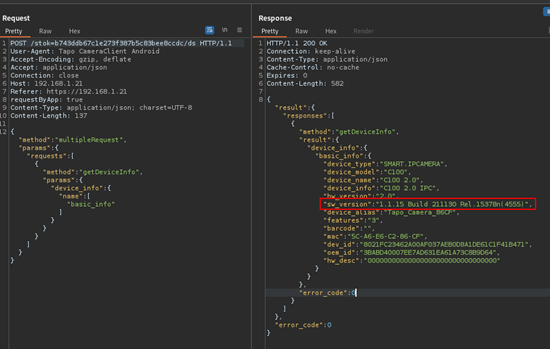
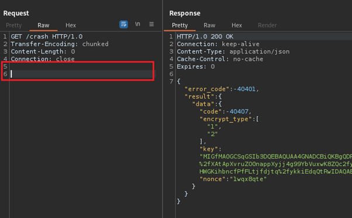
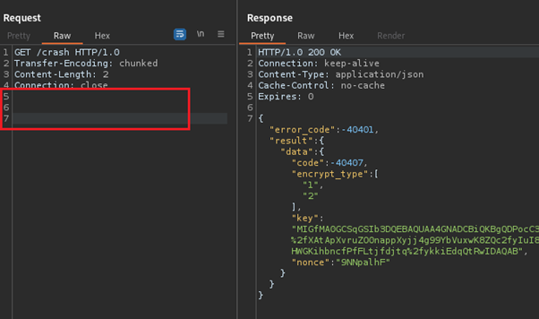
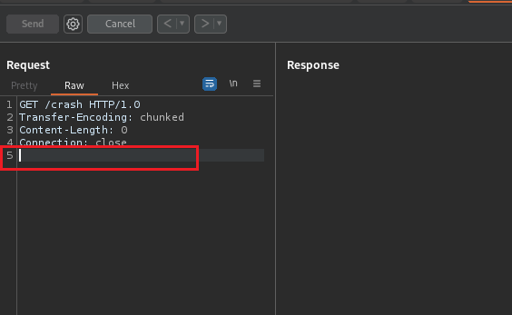
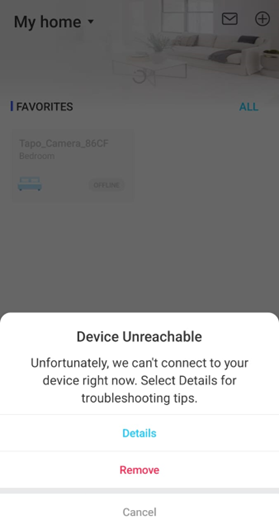
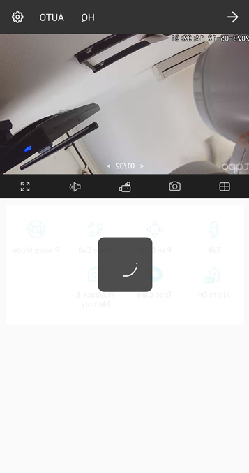

# Basic Information
- **CVE ID**: [CVE-2023-39610](https://nvd.nist.gov/vuln/detail/CVE-2023-39610)
- **Affected Product**: TP-Link Tapo C100
- **Affected Version**: v1.1.15 Build 211130 Rel.15378n(4555) or earlier
- **Vulnerability Name**: HTTP Denial-of-service
- **Vulnerability Type**: Denial-of-service
- **Vulnerability Severity Score** (refer to CVSS 3.1): 6.5 Medium [CVSS:3.1/AV:A/AC:L/PR:N/UI:N/S:U/C:N/I:N/A:H](https://www.first.org/cvss/calculator/3.1#CVSS:3.1/AV:A/AC:L/PR:N/UI:N/S:U/C:N/I:N/A:H)
- **VDP**: https://www.tp-link.com/us/press/security-advisory/
- **Researcher**: Aden Yap (BAE Systems DI)
- **Date Reported**: 1 June 2023

------------------------------
# Description
The TAPO C100 http service exhibits unexpected behavior when receiving HTTP requests. Sending a request with a single CRLF (Carriage Return Line Feed) causes the HTTP service on the TAPO C100's IP address to become inaccessible for a certain period, resulting in a potential Denial of Service (DoS) vulnerability. However, it has been observed that this DoS condition affects only the users accessing the TAPO C100 mobile app control menu from within the same network as the TAPO C100's IP address. Users accessing the TAPO C100 mobile app control menu from the internet via a TAPO cloud service may still be able to access the service during the DoS condition.
Furthermore, it has been observed that the impact of this vulnerability is cumulative. For example, if multiple requests with a single CRLF are sent to the server, the duration of unavailability increases with each request. For instance, one request results in a 2-minute unavailability, ten requests lead to a 10-minute unavailability, and so on. This escalating impact indicates a potential amplification factor for attackers attempting to disrupt the service.

-----------------------------
# Proof Of Concept

By sending a GET request with a single CRLF in the headers, the HTTP service on the server's IP address becomes unresponsive for a significant amount of time, causing a disruption in the availability of the TAPO C100 control menu. This behavior suggests a flaw or limitation in the http service’s request handling or parsing logic. Interestingly, sending a request with more than two CRLFs allows the server to handle the request correctly.
It is important to note that this DoS vulnerability primarily impacts users who are within the same network as the TAPO C100. Users accessing the server from the internet, via a backed cloud service may still be able to access the service during the DoS condition.

1.	Confirming the software version of the Tapo C100.

**Figure 1: Software version**

2.	The requests were handled by the server correctly and without errors.

**Figure 2: A request with two CRLF in the headers**

**Figure 3: A request with three CRLF in the headers**

3.	The request with one CRLF in the headers that causing a DoS in the availability of the TAPO C100 HTTP service
   

**Figure 4: A request with a single CRLF in the headers that causing DoS**

4.	The behavior of the TAPO C100 control menu was inaccessible when the HTTP service was down.

**Figure 5: The TAPO C100 was offline when the DoS was happening**

5.	Sometimes, when one or two DoS requests are made, the Video Camera managed by the Real-Time Streaming Protocol (RTSP) service on TAPO C100 the control menu may be accessible. However, the features on the control menu cannot be used, and the camera will go offline after a short period of time

**Figure 6: The TAPO C100 video camera was still running but the features were keep loading (unavailable)**

----------------------------
# Recommendation Remediation

All TP-Link Tapo C100 customers must take action and update the latest official firmware of **Tapo C100 V2.0 1.3.9 Build 231019 Rel.40264n** via the Tapo mobile app to address this vulnerability discovered in TAPO C100.

# Reference:
- MITRE : https://cve.mitre.org/cgi-bin/cvename.cgi?name=CVE-2023-39610
- NVD : https://nvd.nist.gov/vuln/detail/CVE-2023-39610
- TP-Link Tapo C100 : https://www.tp-link.com/my/support/download/tapo-c100/v2/

---------------------------
# Timeline
- 01.06.2023 - Reported to TP-Link Technical Support
- 07.06.2023 - Recieved response from TP-Link
- 05.07.2023 - TP-Link accepted this is valid vulnerability and will fix this issue in the new firmware release
- 27.10.2023 - Tp-Link released firmware with fixed vulnerability
- 27.10.2023 - Published technical details
- 31.10.2023 - Assigned CVE
