# Basic Information
- **CVE ID**: (In progress of requesting)
- **Affected Product**: [Mage-AI](https://github.com/mage-ai/mage-ai)
- **Affected Version**: v0.9.75 (Tested Latest Release before the publication - 6 December 2024), the vulnerability was reported in v0.9.69 (Release - March 28, 2024)
- **Vulnerability Name**: Insecure Default Authentication Setup Leading to Zero-Click RCE
- **Vulnerability Type**: Insecure Default Configuration [CWE-1188](https://cwe.mitre.org/data/definitions/1188.html)
- **Vulnerability Severity Score** (refer to CVSS 3.1): 9.8 Critical [CVSS:3.1/AV:A/AC:L/PR:N/UI:N/S:U/C:N/I:N/A:H](https://www.first.org/cvss/calculator/3.1#CVSS:3.1/AV:N/AC:L/PR:N/UI:N/S:U/C:H/I:H/A:H)
- **VDP**: https://github.com/mage-ai/mage-ai/security
- **Researcher**: Aden Yap & [Ali Radzali](https://github.com/H0j3n) (BAE Systems DI)
- **Date Reported**: 27 Feburary 2025

------------------------------
# Description
The application lacks proper user authentication by default, allowing anyone to access it without authentication. Although there is an option to enable user authentication, it is not prominently displayed, and users may not be aware of its existence. This oversight poses a significant vulnerability. The absence of proper authentication opens the door for unauthorized access. An attacker could achieve zero-click remote code execution (RCE) due to this flaw. Essentially, an attacker can exploit the lack of authentication to execute arbitrary code without any user interaction. This represents a severe risk; this can lead to a compromise of the web service or the server..

-----------------------------
# Proof Of Concept

1. In the pipeline feature, you can add a custom Python block and there was not restriction on the import modules. This block can be used to execute OS commands on the target machine by importing the OS module.

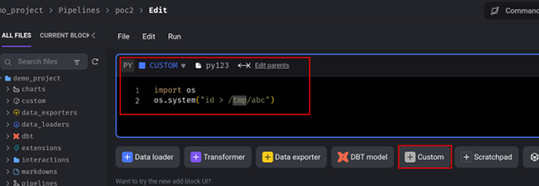

**Figure 1: Add custom Python block with the importing the OS module**

2. Execute the Python script within the block to run an OS command. Store the output of this command in a file named /tmp/abc. Verify the success of this attack by examining the OS command output in the file.

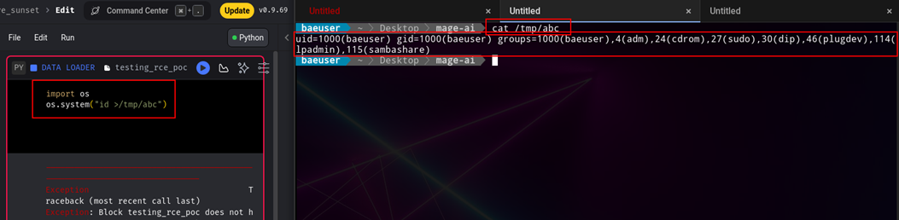

**Figure 2: Achieved OS command execution on the target**

3. The following Python script payload to achieve remote code execution via reverse shell on the target
   
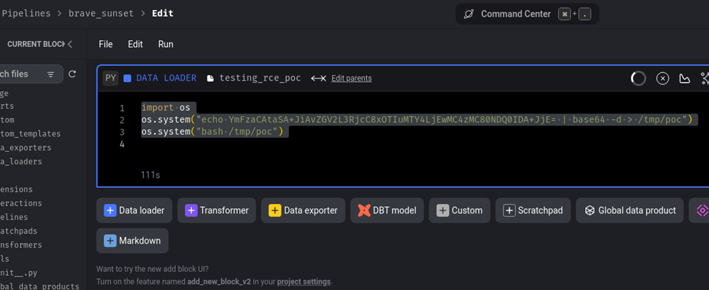

**Figure 3: Executing the reverse shell payload on the Pipeline Python block**

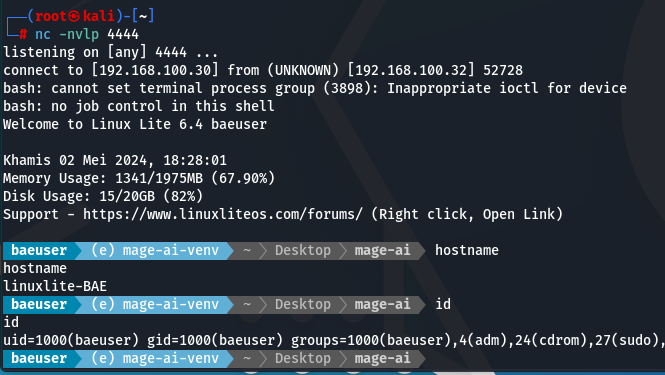

**Figure 4: Receive reverse shell from the target server**

4. To demonstrate the maximum impact of this vulnerability, we developed an exploitation script that can exploit the vulnerability to achieve remote code execution (RCE) with a single command.

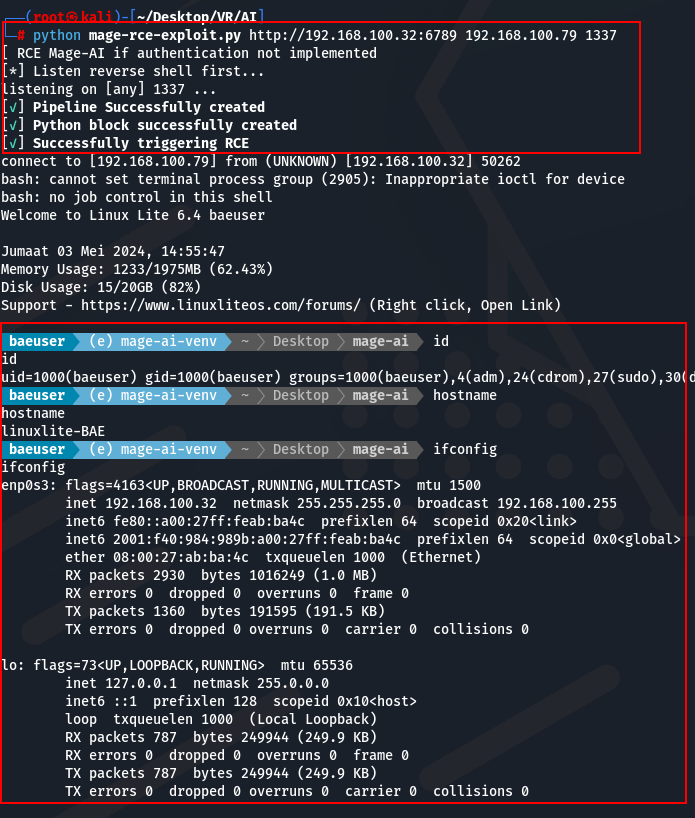

**Figure 5: Remote Code Execution Exploit Script**

----------------------------
# Recommendation & Workaround

We initially reported this issue to the Mage-AI, recommending that authentication be enabled by default during the application's setup process. This would ensure that users are protected out of the box, reducing the risk of unauthenticated access. However, **Mage-AI did not acknowledge this as a security vulnerability**, despite evidence showing that **multiple real-world instances** are affected. Given the potential risk to unaware users, **we are publicly disclosing this information to raise awareness and help users secure their deployments**.

## Workaround Solution
To protect your instance from unauthorised access and RCE, it is critical to manually enable authentication in your deployment. Since authentication is not enabled by default, users must explicitly configure it to secure their instances.

**How to Enable Authentication**
Set the following environment variable when running the application:

``-e REQUIRE_USER_AUTHENTICATION=1``

For full configuration details, refer to the [official documentation](https://docs.mage.ai/production/authentication/overview).

Since authentication settings are not prominently displayed during the application's setup, many users may  be unknowingly deploy the application in an default insecure state. We strongly urge all users to verify their authentication settings and apply the necessary configuration changes immediately.

-----------------------------
# Threat Research Information – Live Vulnerable Instances on The Internet

We performed threat research analysis on the internet to discover vulnerable live instances, using the HTTP response of the Mage-AI application as an indicator. Based on the OSINT results from the Censys, Shodan, FOFA, ZoomEye a total **1045 instances** were found to be publicly accessible on the internet. They are potentially vulnerable to this vulnerability. If performing active reconnaissance on the internet might potentially uncover more instances.  

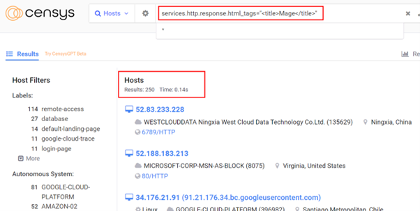

**Figure 6: 250 potential instances discovered on Censys**

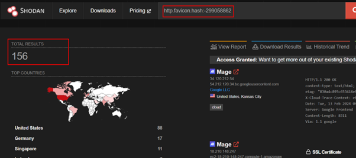

**Figure 7: 156 potential instances discovered on Shodan**

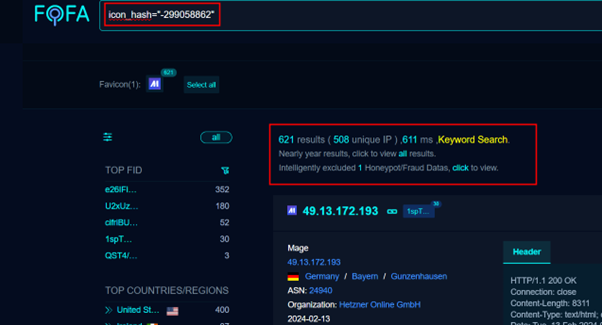

**Figure 8: 508 potential instances discovered on FOFA**

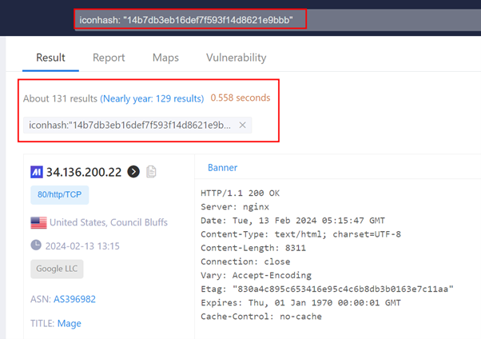

**Figure 9: 131 potential instances discovered on ZoomEye**

To automate the process of discovering unauthenticated Mage-AI application, we created a harmless Nuclei template to scan for this vulnerability. Nuclei returns results from vulnerable instances, indicating whether the Mage-AI application has authentication enabled. If the Mage-AI application does not have authentication enabled and is further exploited, this vulnerability could potentially lead to remote code execution (RCE) on the target. Please note that once this vulnerability has been recognised, this Nuclei template will be published for security community contribution.

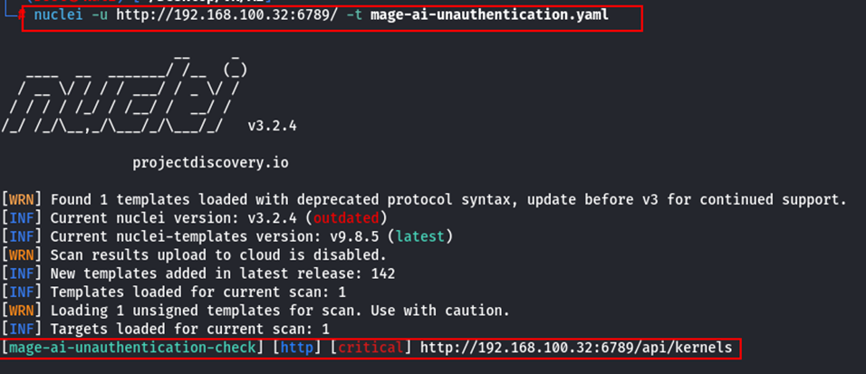

**Figure 10: Nuclei template to scan the vulnerability**

Based on our OSINT results, we randomly selected a few and found that three of them were susceptible to this potential vulnerability. Performing active reconnaissance on the internet could uncover even more vulnerable instances. Additionally, this issue might also affect systems hosted on enterprise internal networks.

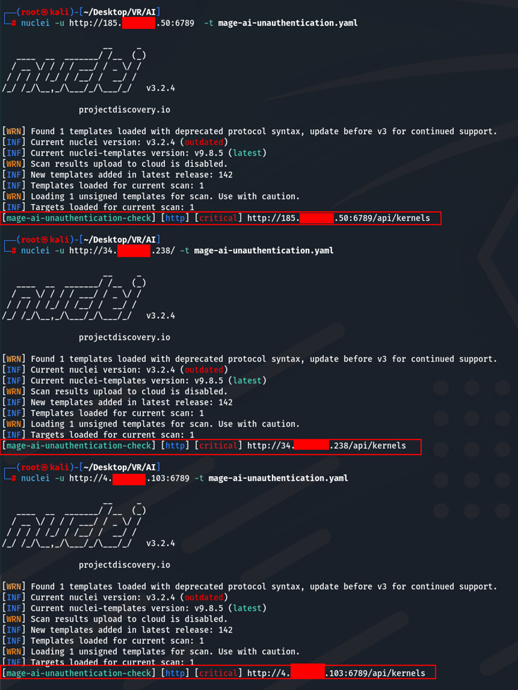

**Figure 11: Live Sample of the vulnereable instances on the internet**

---------------------------
# Timeline
- 06.05.2024 - Reported to Mage-AI Support
- 13.05.2024 - Recieved response from Mage-AI
- 03.01.2025 - After 7 months of repeated follow-ups, the Mage-AI has decided not to accept this issue as a valid security vulnerability and has confirmed that they will not be addressing it.
- 27.02.2025 - Published technical details to warn Mage-AI users the potential risk and workaround
- 27.02.2025 - Requesting CVE
